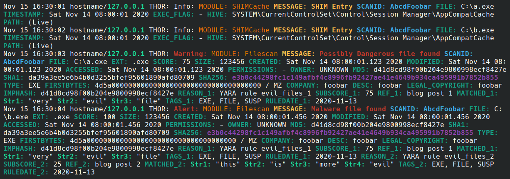
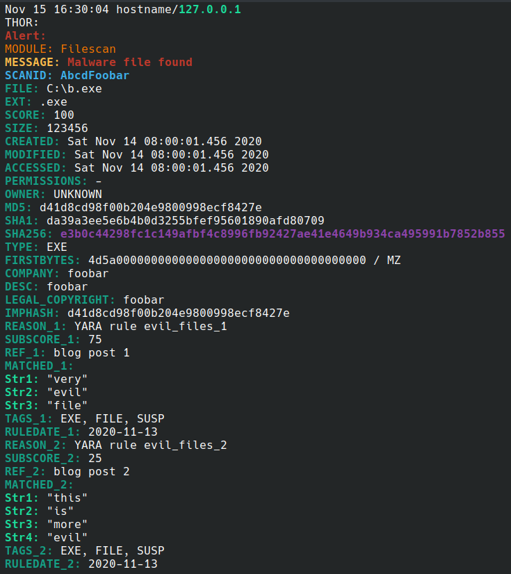

# VIM syntax file for THOR and Loki

A [VIM](https://www.vim.org/) syntax file for log files of [APT Scanner THOR](https://www.nextron-systems.com/thor/) and [Loki](https://github.com/Neo23x0/Loki)



## Installation

Place the file `thor.vim` in `$HOME/.vim/syntax/thor.vim`.

## Usage

For automatic syntax highlighting depending on the default log file names or the extension *.thor, place the following in your `vimrc`:
```vim
filetype plugin on
syntax on
au BufRead *_thor_20*-*-*.txt set filetype=thor
au BufRead loki_*_20*.log set filetype=thor
au BufRead *.thor set filetype=thor
" Uncomment next line to get complete syntax highlighting in very long lines. Might impair VIM performance.
" set synmaxcol=5000
```


Note that VIM does not apply syntax highlighting to `*.txt` files.
For dynamically applying the syntax highlighting via shortcut (in the example below `F2`) add the following to your `vimrc`:

```vim
nnoremap <F2> :set filetype=thor<CR>
```

## Additional tips

### Readability

For toggling between wrapped and unwrapped lines add the following to your `vimrc` (example `F6`):

```vim
nnoremap <F6> :set wrap!<CR>
```

But readability is even better if you are able to split lines.
The following code snippet in your `vimrc` splits the actual line by a push of a button (example `F7`) and jumps to the beginning of the entry.
In order to avoid accidental changes, the file is previously set in a read-only mode.

```vim
nnoremap <F7> :set ro <bar> :s/\S\+:\ /\r\0/g <bar> noh <bar> ?^THOR:\ <CR> :noh <CR> k
```

The result looks like this:



If you still want to save the changed file, you can do this with `:w!` anyway.

### Highlighting not applied to the end of the line

In case of very long lines the highlighting fails because of VIMs default setting.
Change by adding `set synmaxcol=5000` to your `vimrc` or typing `:set synmaxcol=5000` in normal mode.

### Performance issues

If you experience performance issues when using it, try adding the following to your `vimrc`:

```vim
set regexengine=1
```

Depending on your version of VIM this may help:

```vim
set regexengine=0
```
